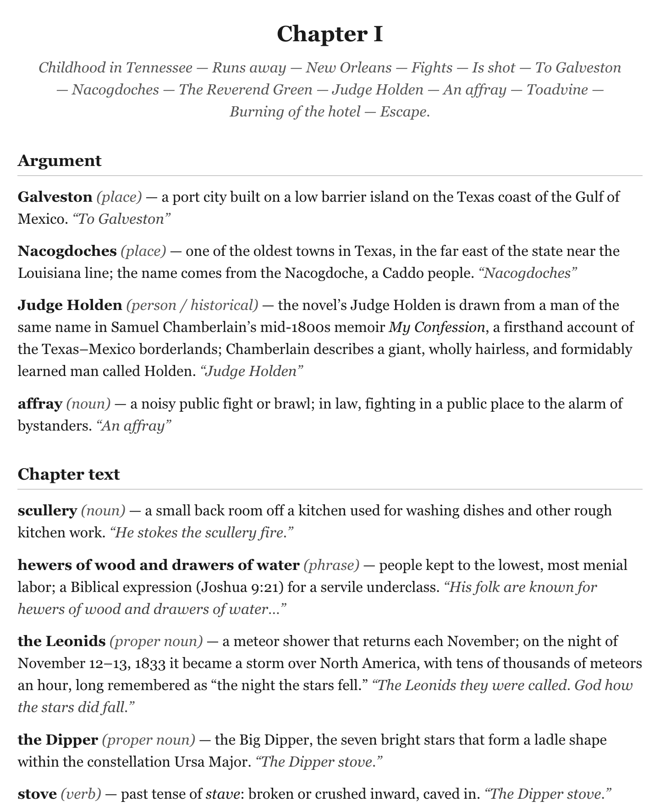

# Blood Meridian Reading Guide

<p align="center"><strong>A chapter-by-chapter vocabulary reading guide to Cormac McCarthy's Blood Meridian, with bonus pop-up Kindle dictionaries</strong></p>

<p align="center">
  <a href="LICENSE"></a>
  <a href="https://github.com/federbenjamin/blood-meridian-reading-guide/releases/latest"></a>
</p>

<p align="center"></p>

A chapter-by-chapter vocabulary companion to Cormac McCarthy's *Blood Meridian*. It defines the novel's archaic, dialectal, foreign, and technical words in reading order, each with the sentence from the book it appears in.

## Download

You need an e-reader app, or a Kindle for the pop-up dictionary. Download the reading guide and the recommended dictionary from the [latest release](https://github.com/federbenjamin/blood-meridian-reading-guide/releases/latest):

```
curl -LO https://github.com/federbenjamin/blood-meridian-reading-guide/releases/latest/download/Blood_Meridian_Vocabulary_Companion.epub -LO https://github.com/federbenjamin/blood-meridian-reading-guide/releases/latest/download/Blood_Meridian_Dictionary_Extended.mobi
```

The other two dictionaries are in [`dictionaries/`](dictionaries).

## Features

- **The reading guide.** `Blood_Meridian_Vocabulary_Companion.epub`: ~1,500 terms, chapter by chapter, each with a definition and its book quote. Opens in any e-reader.
- **Pop-up definitions on Kindle.** `Blood_Meridian_Dictionary_Extended.mobi`: Webster's 1913 (~102,000 words) with the book's ~1,300 special terms folded in. For those terms the popup shows the in-context gloss and book quote first, then the general definition. Recommended.
- **Webster's 1913 alone.** `Webster_1913_Dictionary.mobi`.
- **The book's terms alone.** `Blood_Meridian_Dictionary.mobi`: the ~1,300 Blood Meridian terms only.

## Usage

### Using the reading guide

- Kindle: copy `Blood_Meridian_Vocabulary_Companion.epub` to the Kindle's `documents` folder over USB, or email it with [Send to Kindle](https://www.amazon.com/sendtokindle).
- Apple Books, Kobo, Google Play Books, or any reader app: open the `.epub`.

### Using the pop-up dictionaries (Kindle)

Sideload over USB. Send-to-Kindle often will not register a file as a dictionary.

1. Connect the Kindle by USB. It appears as a drive.
2. Copy a `.mobi` (the Extended one is recommended) into the `documents` folder.
3. Eject and unplug.
4. On the Kindle, open Settings > Languages & Dictionaries > Dictionaries. Under English, set it as the default, or switch per book by long-pressing a word and tapping the dictionary name in the popup.

## Contributing

Report a wrong or missing definition, or any other problem, in [Issues](https://github.com/federbenjamin/blood-meridian-reading-guide/issues). Pull requests are welcome; see [CONTRIBUTING.md](https://github.com/federbenjamin/.github/blob/main/CONTRIBUTING.md), and report a security issue as [SECURITY.md](https://github.com/federbenjamin/.github/blob/main/SECURITY.md) says.

The dictionaries are rebuilt by `src/build_dicts.py`; [docs/BUILD.md](docs/BUILD.md) explains how. Run the tests from the repo root:

```
python3 -m unittest discover -s tests
```

## License

MIT © Benjamin Feder

The build script, the tests, and the glosses written for this guide are under the [MIT license](LICENSE).

The sentences quoted from *Blood Meridian* are not. They stay under the book's own copyright (© 1985 Cormac McCarthy) and appear here as short quotations that illustrate word meanings. The EPUB and the dictionaries contain both.

The Webster's 1913 definitions are in the public domain.

Compiled by Benjamin Feder. General definitions from Webster's 1913 Dictionary (public domain), via [matthewreagan/WebstersEnglishDictionary](https://github.com/matthewreagan/WebstersEnglishDictionary). Short quotations from *Blood Meridian* illustrate word meanings.
